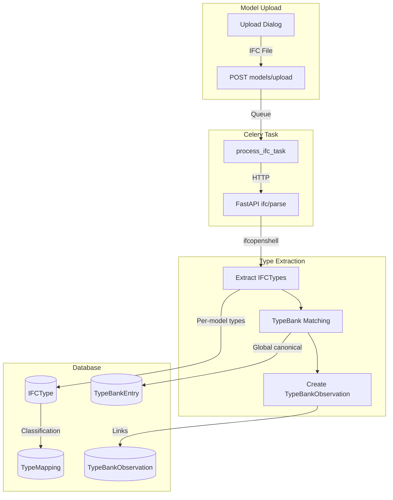
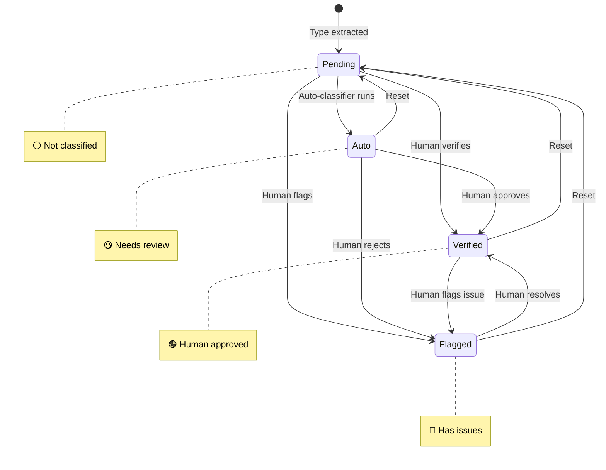
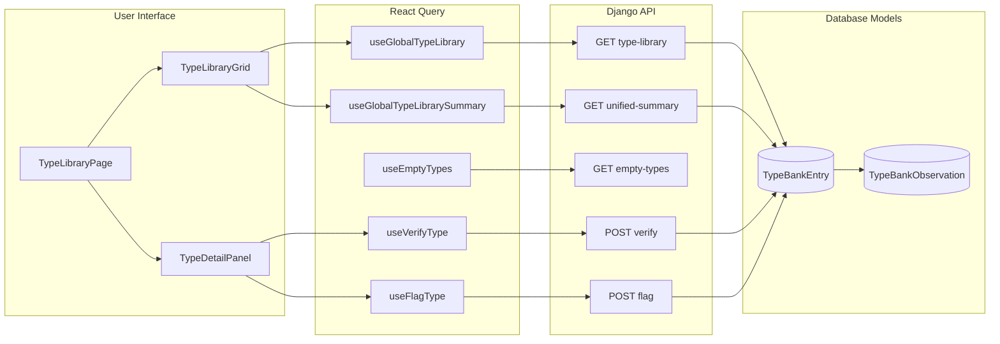
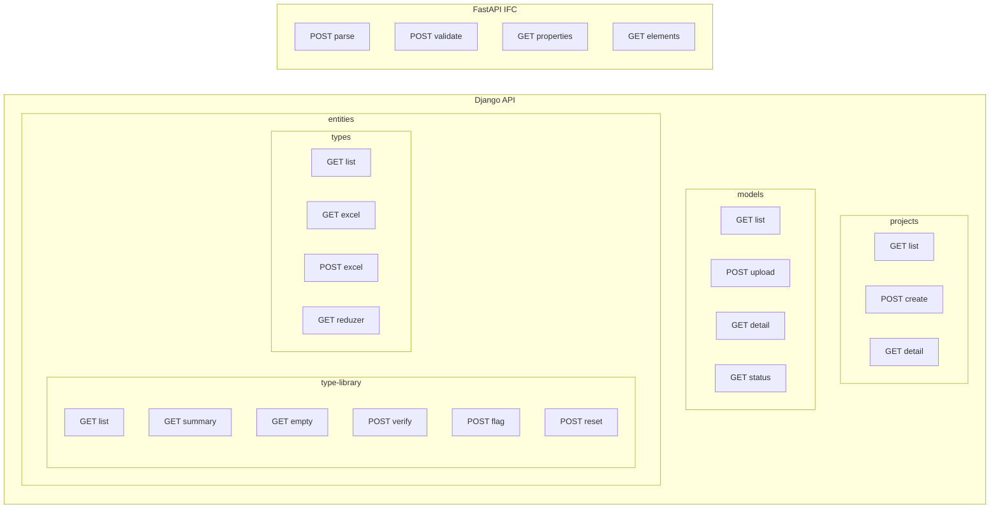
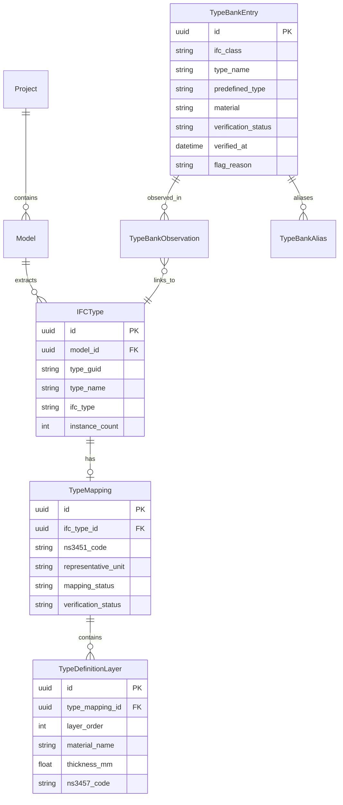

# Sprucelab - Project Status & Architecture

> **Last Updated**: February 7, 2026
> **Current Phase**: MVP Phase 1 Complete
> **PRD Reference**: [PRD v2.0](../plans/PRD_v2.md)
> **Architecture Diagrams**: [architecture-flowchart.md](./architecture-flowchart.md)

---

## Executive Summary

**Vision**: "Drop your IFC → See all your types → Verify, classify, and track."

Sprucelab is a **type-centric BIM intelligence platform** for professionals who **USE** building models, not create them. The core insight: buildings have 50,000 entities but only 300-500 unique types. By focusing on types, we achieve 10-15x faster processing and enable cross-project knowledge reuse.

| Metric | Value |
|--------|-------|
| Parse time (100MB model) | **2 seconds** |
| Types extracted | 623 (from test models) |
| Performance gain | **10-15x faster** |
| Type consolidation | 63% reduction (974 → 357) |
| Frontend languages | English + Norwegian |

---

## Vision & Strategy

### Core Insight (from PRD v2.0)

> **Types are the unit of coordination in BIM, not individual entities.**

A 50,000-entity building has only 300-500 unique types. By extracting, classifying, and tracking types instead of entities, we:
- Parse models in seconds, not minutes
- Build cross-project type intelligence (classify once, apply everywhere)
- Enable meaningful verification at a human-manageable scale

### What We ARE

| Feature | Description | PRD Status |
|---------|-------------|------------|
| **Type Warehouse** | Extract, classify, track types across models | MVP Priority #1 ✅ |
| **Verification Engine** | Core rules + custom rules per project | MVP Priority #2 🟡 |
| **TypeBank** | Cross-project type intelligence | Core Feature ✅ |
| **Excel Workflows** | Bidirectional type classification | Built, UI pending |
| **LCA Export** | Material layers → Reduzer/OneClickLCA | Endpoints ready |
| **3D Viewer** | Type instance navigation and filtering | Core Feature ✅ |

### What We Are NOT

- **NOT** a modeling tool (we don't create IFC)
- **NOT** clash detection (Solibri/Navisworks territory)
- **NOT** document management (ACC/Dalux territory)
- **NOT** general property editor (too broad, Excel workflow sufficient)

### Target Users

BIM professionals who **receive and use** models:
- BIM Coordinators validating model quality
- Quantity Surveyors extracting type-based QTO
- Sustainability Engineers doing LCA analysis
- FM Managers tracking building types

---

## Architecture Overview

### High-Level System Architecture

```mermaid
flowchart TB
    subgraph Frontend["Frontend (React + Vite)"]
        subgraph Pages["Pages"]
            TLP[TypeLibraryPage]
            BMW[BIMWorkbench]
            PM[ProjectModels]
            FV[FederatedViewer]
        end

        subgraph Components["Components"]
            TLG[TypeLibraryGrid]
            TDP[TypeDetailPanel]
            VB[VerificationBadge]
            TMG[TypeMappingGrid]
            MLE[MaterialLayerEditor]
        end

        subgraph Hooks["React Query Hooks"]
            UW[use-warehouse.ts]
            UP[use-projects.ts]
            UM[use-models.ts]
        end
    end

    subgraph Backend["Backend Services"]
        subgraph Django["Django REST API :8000"]
            EA["api/entities"]
            PA["api/projects"]
            MA["api/models"]
            TLA["api/type-library"]
        end

        subgraph FastAPI["FastAPI IFC Service :8001"]
            IFC["ifc/parse"]
            VAL["ifc/validate"]
            PROP["ifc/properties"]
        end
    end

    subgraph Database["PostgreSQL (Supabase)"]
        TB[(TypeBankEntry)]
        TM[(TypeMapping)]
        IT[(IFCType)]
        PR[(Project)]
        MD[(Model)]
    end

    Pages --> Components
    Components --> Hooks
    Hooks -->|HTTP REST| Django
    Django -->|Internal| FastAPI
    Django -->|ORM| Database
    FastAPI -->|Direct SQL| Database
```



### Django vs FastAPI: Why Two Services?

| Concern | Django | FastAPI |
|---------|--------|---------|
| **User Auth & Sessions** | ✅ Built-in | ❌ Not designed for |
| **ORM & Relationships** | ✅ Excellent | ❌ Manual SQL |
| **Heavy File I/O** | ❌ Request/response blocking | ✅ Async, streaming |
| **CPU-Bound Processing** | ❌ Not optimized | ✅ Process pools |
| **Horizontal Scaling** | ❌ Tied to auth | ✅ Stateless |

**Rule**: Django coordinates, FastAPI processes.

---

## Key Architectural Decisions

### 1. Types-Only Architecture (Session 031 Breakthrough)

**Problem**: Entity-level processing was slow and storage-intensive.
- Old approach: Extract all 50,000 entities with properties
- Parse time: 10-30 seconds per model
- Storage: Thousands of rows per model

**Decision**: Extract types only, store `instance_count` directly.
- Extract ~300-500 types per model
- Store type definitions with count, not individual entities
- Viewer loads IFC directly (no pre-processing)

**Result**:
- Parse time: **2 seconds** (10-15x faster)
- Database: ~100-500 rows per model
- Type consolidation: 63% reduction

**PRD Alignment**: Enables MVP Priority #1 (Type Dashboard) with instant feedback.

### 2. Django vs FastAPI Split

**Problem**: Django not designed for heavy file I/O.
- IFC files can be 500MB+
- IfcOpenShell parsing is blocking/CPU-bound
- Django's sync request/response cycle not suitable

**Decision**: Microservices architecture.
- Django: Auth, project metadata, TypeBank coordination
- FastAPI: IFC parsing, validation, property queries
- Communication: Internal HTTP with shared PostgreSQL

**Result**:
- Scalable processing (FastAPI can scale independently)
- Clean separation of concerns
- Async file handling with proper timeouts

**PRD Alignment**: Supports "Drop your IFC" instant feedback promise.

### 3. TypeBank (Cross-Project Intelligence)

**Problem**: Same types classified repeatedly across projects.
- IfcWallType:EXTERNAL_WALL appears in every project
- Users re-classify the same types endlessly

**Decision**: Global type library with observations.
- `TypeBankEntry`: Canonical type definition (identity tuple)
- `TypeBankObservation`: Where types appear across projects
- Confidence scoring based on observation count

**Result**:
- Classify once, apply everywhere
- Cross-project insights (which types are common)
- Knowledge accumulates over time

**PRD Alignment**: Core Type Warehouse feature.

### 4. Verification Status (3-Tier Human System)

**Problem**: Need human validation of classifications.
- Auto-classification isn't always correct
- Need audit trail for verified types
- Need way to flag problematic types

**Decision**: 4-status verification workflow.
```
pending → auto → verified ↔ flagged
                    ↑
                    └── reset
```

**Result**:
- Clear trust hierarchy (machine vs human)
- Flagging with reasons for follow-up
- Audit trail with timestamps

**PRD Alignment**: MVP Priority #2 (Verification Engine).

### 5. ThatOpen Fragments for 3D

**Problem**: Raw IFC loading slow in browser.
- Large IFC files (100MB+) take 30+ seconds to load
- WebGL memory pressure
- No caching between sessions

**Decision**: Pre-convert to ThatOpen Fragments binary format.
- Optimized for web rendering
- Cached for instant reload
- Supports multi-model federation

**Result**:
- 10-100x faster viewer loading
- Smooth multi-model experience
- Type-based filtering in viewer

**PRD Alignment**: Viewer performance requirement.

---

## Data Flow Diagrams

### IFC Processing Pipeline



### Verification Workflow



### Type Library Data Flow



---

## Current Implementation Status

### ✅ Phase 1 Complete (Type Library)

**Backend (Django)**:
- [x] TypeBankEntry model with verification workflow
- [x] TypeBankObservation for cross-project tracking
- [x] GlobalTypeLibraryViewSet with all endpoints
- [x] TypeMapping for per-model classification
- [x] TypeDefinitionLayer for material composition
- [x] NS3451 reference data loaded
- [x] SemanticType normalization system
- [x] Excel export endpoint
- [x] Reduzer export endpoint

**Backend (FastAPI)**:
- [x] IFC parsing with types-only extraction
- [x] 2-second processing time achieved
- [x] Property query endpoints
- [x] Fragments generation endpoint

**Frontend (React)**:
- [x] TypeLibraryPage with 3-panel layout
- [x] TypeLibraryGrid with grouped columns
- [x] TypeDetailPanel with tabbed interface
- [x] VerificationBadge status indicators
- [x] TypeMappingGrid for per-model types
- [x] MaterialLayerEditor (sandwich diagram)
- [x] Keyboard shortcuts (A=save, F=flag, I=ignore)
- [x] i18n (English + Norwegian Bokmål)
- [x] 3D Viewer with type filtering

### 🟡 In Progress (Verification Engine)

**Built**:
- [x] ProjectConfig model (JSON-based rules)
- [x] Validation endpoint structure in FastAPI
- [x] Verification status workflow

**Pending**:
- [ ] Rule execution engine
- [ ] ProjectConfig → validation rules resolution
- [ ] Per-type issue reporting
- [ ] Health score calculation

### ⏳ Planned (Phase 2)

| Feature | Description | Priority |
|---------|-------------|----------|
| Sandwich View | 2D material section diagram | MVP #3 |
| Rule Configuration GUI | Visual rule builder | MVP #4 |
| Version Change Badges | new/removed/changed indicators | MVP #5 |
| Excel Import UI | Wire import endpoint to frontend | High |
| BCF Export | Export issues as BCF | Medium |

### 🔴 Deprioritized

| Feature | Reason |
|---------|--------|
| BEP System | Over-engineered; ProjectConfig sufficient |
| Full Property Editing | Excel workflow sufficient |
| Graph Queries | Over-engineered for MVP |
| Clash Detection | Solibri's moat, not our focus |

---

## Tech Stack Summary

| Layer | Technology | Version | Purpose |
|-------|------------|---------|---------|
| **Backend Coordination** | Django + DRF | 5.0 | Auth, metadata, TypeBank API |
| **Heavy Processing** | FastAPI | 0.109 | IFC parsing, validation |
| **IFC Parsing** | IfcOpenShell | 0.8.x | IFC file operations |
| **Database** | PostgreSQL | 15 | Persistent storage (Supabase) |
| **Task Queue** | Celery + Redis | 5.3 | Async processing |
| **Frontend** | React + TypeScript | 18.2 | UI/UX |
| **Build Tool** | Vite | 5.x | Fast dev server, bundling |
| **3D Viewer** | ThatOpen + Three.js | 2.4.11 | BIM visualization |
| **UI Components** | shadcn/ui + Radix | - | Accessible components |
| **Styling** | Tailwind CSS | 4.0 | Utility-first CSS |
| **State Management** | TanStack Query | 5.12 | Server state caching |
| **i18n** | react-i18next | 16.5 | Internationalization |
| **Deployment** | Railway | - | Backend hosting |

---

## API Reference

### Django REST API Endpoints



### Hook to API Mapping

| Hook | HTTP Method | Endpoint | Purpose |
|------|-------------|----------|---------|
| `useGlobalTypeLibrary` | GET | `/api/entities/type-library/` | List all types with filters |
| `useGlobalTypeLibrarySummary` | GET | `/api/entities/type-library/unified-summary/` | Dashboard stats |
| `useEmptyTypes` | GET | `/api/entities/type-library/empty-types/` | Types with 0 instances |
| `useVerifyType` | POST | `/api/entities/type-library/{id}/verify/` | Mark as verified |
| `useFlagType` | POST | `/api/entities/type-library/{id}/flag/` | Flag with reason |
| `useResetVerification` | POST | `/api/entities/type-library/{id}/reset-verification/` | Reset to pending |
| `useProjects` | GET | `/api/projects/` | List projects |
| `useModels` | GET | `/api/models/` | List models |
| `useTypeMappings` | GET | `/api/entities/types/` | Per-model types |

---

## Data Models

### Entity Relationship Diagram



### Key Models Explained

| Model | Purpose | Key Fields |
|-------|---------|------------|
| **TypeBankEntry** | Global canonical type | ifc_class, type_name, verification_status |
| **TypeBankObservation** | Where types appear | type_bank_entry_id, ifc_type_id, instance_count |
| **IFCType** | Per-model type | model_id, type_guid, instance_count |
| **TypeMapping** | Classification | ifc_type_id, ns3451_code, representative_unit |
| **TypeDefinitionLayer** | Material sandwich | type_mapping_id, material_name, thickness_mm |

---

## Key Metrics

| Metric | Before (Session 030) | After (Session 031) |
|--------|---------------------|---------------------|
| Parse time (100MB) | 10-30 seconds | **2 seconds** |
| DB rows per model | 1000s | ~100-500 types |
| Type consolidation | N/A | 63% reduction |
| Viewer loading | 30+ seconds | **Instant** (fragments) |

| Current Stats | Value |
|--------------|-------|
| Types in database | 623 |
| Types pending classification | 620 (97%) |
| i18n languages | 2 (EN/NO) |
| Frontend bundle size | ~7MB |
| API endpoints | 20+ |

---

## Next Steps (PRD-Aligned)

### Immediate (This Week)

1. **Production Migration**: Run Django migrations on Railway to add `reused_status` column
2. **Test Dashboard**: Verify dashboard works in production with real data

### MVP Priority #2: Verification Engine

1. Define rule schema in ProjectConfig
2. Build rule execution engine in FastAPI
3. Connect ProjectConfig → validation rules
4. Per-type issue reporting
5. Health score calculation

### MVP Priority #3: Sandwich View

1. Design 2D material section diagram component
2. Render TypeDefinitionLayer as visual sandwich
3. Add to TypeDetailPanel Materials tab

### MVP Priority #4: Rule Configuration

1. JSON/YAML rule file format
2. GUI builder for visual rule editing
3. Import/export rule sets

### Future (Phase 2+)

- Version Change Badges (new/removed/changed)
- BCF Export from verification failures
- Design scenarios for LCA comparison

---

## File Structure

```
sprucelab/
├── CLAUDE.md                        # Project context for AI
├── docs/
│   ├── knowledge/
│   │   ├── PROJECT_STATUS.md        # This document
│   │   └── architecture-flowchart.md # Detailed diagrams
│   ├── plans/
│   │   └── PRD_v2.md                # Product Requirements
│   ├── worklog/                     # Session logs
│   └── todos/                       # Task tracking
│
├── backend/
│   ├── config/                      # Django settings
│   ├── apps/
│   │   ├── projects/               # Project/ProjectConfig models
│   │   ├── models/                 # Model versioning
│   │   ├── entities/               # IFCType, TypeBank, TypeMapping
│   │   └── ...
│   └── ifc-service/                # FastAPI microservice
│       ├── endpoints/              # API routes
│       └── services/               # Business logic
│
└── frontend/
    └── src/
        ├── pages/                   # Route pages
        ├── components/features/
        │   ├── warehouse/          # Type classification UI
        │   └── viewer/             # 3D BIM viewer
        ├── hooks/                  # React Query hooks
        └── i18n/locales/           # EN/NO translations
```

---

## References

- **PRD v2.0**: [docs/plans/PRD_v2.md](../plans/PRD_v2.md)
- **Architecture Diagrams**: [docs/knowledge/architecture-flowchart.md](./architecture-flowchart.md)
- **Session Logs**: [docs/worklog/](../worklog/)
- **CLAUDE.md**: [/CLAUDE.md](../../CLAUDE.md)
