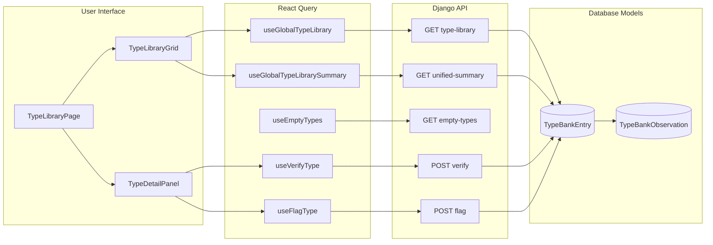
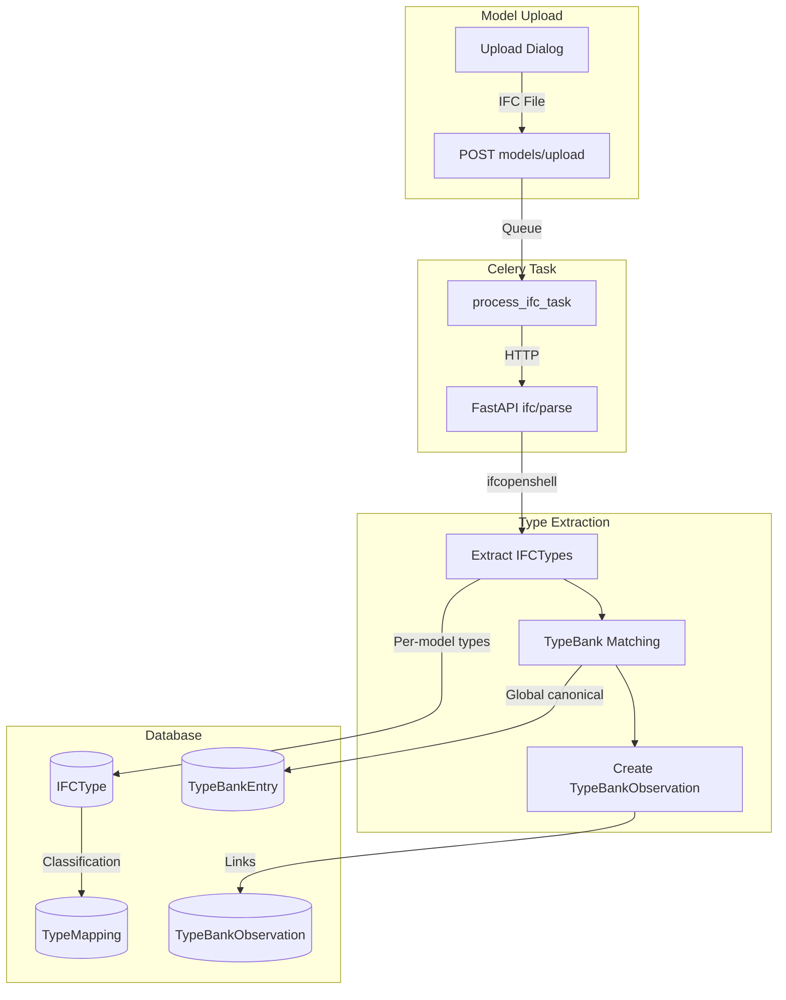
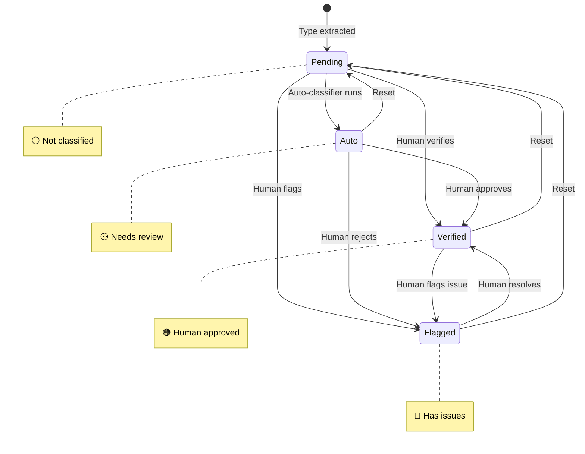
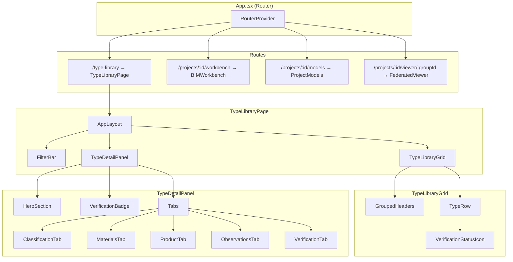
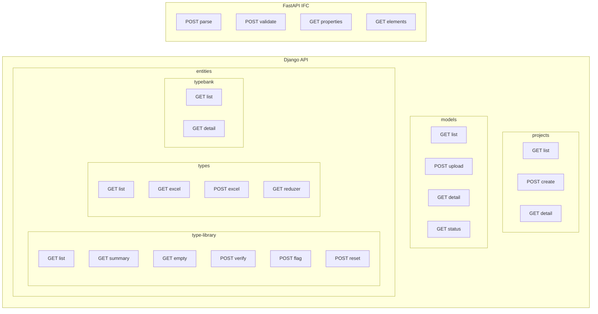
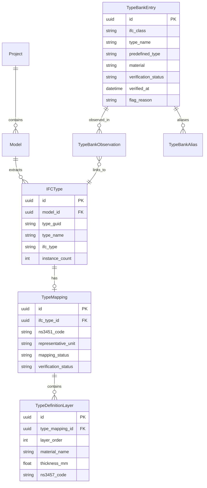

# Sprucelab Architecture Flowchart

## High-Level System Architecture

```mermaid
flowchart TB
    subgraph Frontend["Frontend (React + Vite)"]
        subgraph Pages["Pages"]
            TLP[TypeLibraryPage]
            BMW[BIMWorkbench]
            PM[ProjectModels]
            FV[FederatedViewer]
        end

        subgraph Components["Components"]
            TLG[TypeLibraryGrid]
            TDP[TypeDetailPanel]
            VB[VerificationBadge]
            TMG[TypeMappingGrid]
            MLE[MaterialLayerEditor]
        end

        subgraph Hooks["React Query Hooks"]
            UW[use-warehouse.ts]
            UP[use-projects.ts]
            UM[use-models.ts]
        end
    end

    subgraph Backend["Backend Services"]
        subgraph Django["Django REST API :8000"]
            EA["api/entities"]
            PA["api/projects"]
            MA["api/models"]
            TLA["api/type-library"]
        end

        subgraph FastAPI["FastAPI IFC Service :8001"]
            IFC["ifc/parse"]
            VAL["ifc/validate"]
            PROP["ifc/properties"]
        end
    end

    subgraph Database["PostgreSQL (Supabase)"]
        TB[(TypeBankEntry)]
        TM[(TypeMapping)]
        IT[(IFCType)]
        PR[(Project)]
        MD[(Model)]
    end

    Pages --> Components
    Components --> Hooks
    Hooks -->|HTTP REST| Django
    Django -->|Internal| FastAPI
    Django -->|ORM| Database
    FastAPI -->|Direct SQL| Database
```



## Type Library Data Flow



## IFC Processing Pipeline



## Verification Workflow



## Frontend Component Hierarchy



## API Endpoints Map



## Data Models Relationship



## Hook to API Mapping

| Hook | HTTP Method | Endpoint | Purpose |
|------|-------------|----------|---------|
| `useGlobalTypeLibrary` | GET | `/api/entities/type-library/` | List all types with filters |
| `useGlobalTypeLibrarySummary` | GET | `/api/entities/type-library/unified-summary/` | Dashboard stats |
| `useEmptyTypes` | GET | `/api/entities/type-library/empty-types/` | Types with 0 instances |
| `useVerifyType` | POST | `/api/entities/type-library/{id}/verify/` | Mark as verified |
| `useFlagType` | POST | `/api/entities/type-library/{id}/flag/` | Flag with reason |
| `useResetVerification` | POST | `/api/entities/type-library/{id}/reset-verification/` | Reset to pending |
| `useProjects` | GET | `/api/projects/` | List projects |
| `useModels` | GET | `/api/models/` | List models |
| `useTypeMappings` | GET | `/api/entities/types/` | Per-model types |
| `useTypeBank` | GET | `/api/entities/typebank/` | Global type bank |

## File Structure

```
frontend/src/
├── App.tsx                          # Router with all routes
├── pages/
│   ├── TypeLibraryPage.tsx          # /type-library
│   ├── BIMWorkbench.tsx             # /projects/:id/workbench
│   ├── ProjectModels.tsx            # /projects/:id/models
│   └── FederatedViewer.tsx          # /projects/:id/viewer/:groupId
├── components/features/warehouse/
│   ├── TypeLibraryGrid.tsx          # Grouped column grid
│   ├── TypeDetailPanel.tsx          # Detail panel with tabs
│   ├── VerificationBadge.tsx        # Status badges
│   ├── TypeMappingGrid.tsx          # Per-model type grid
│   └── MaterialLayerEditor.tsx      # Material sandwich editor
├── hooks/
│   ├── use-warehouse.ts             # Type library hooks
│   ├── use-projects.ts              # Project hooks
│   └── use-models.ts                # Model hooks
└── i18n/locales/
    ├── en.json                      # English translations
    └── nb.json                      # Norwegian translations

backend/apps/entities/
├── models.py                        # TypeBankEntry, IFCType, TypeMapping
├── views.py                         # GlobalTypeLibraryViewSet, etc.
├── serializers.py                   # DRF serializers
├── urls.py                          # API routes
└── migrations/
    └── 0024_add_verification_status.py

backend/ifc-service/
├── main.py                          # FastAPI app
├── endpoints/
│   ├── ifc_operations.py            # /ifc/parse, /ifc/export
│   └── property_editor.py           # /ifc/properties
└── services/
    ├── ifc_parser.py                # ifcopenshell operations
    └── validation_engine.py         # Validation rules
```
