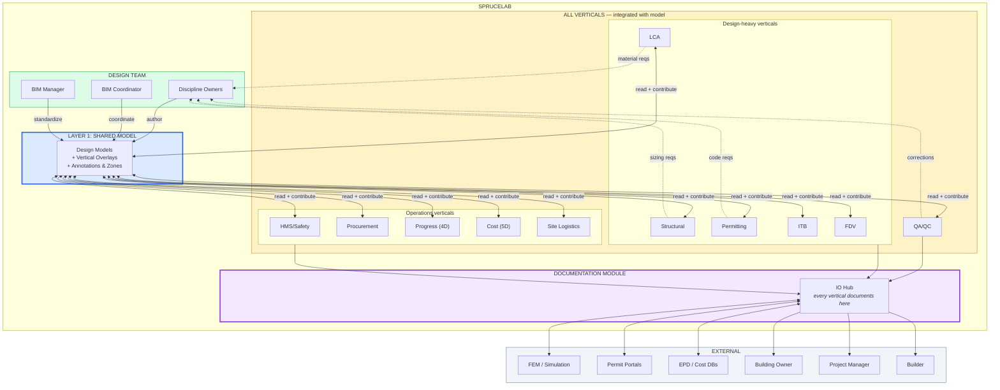

# Sprucelab Platform Architecture — Product Map v5

## Core Principles

### 1. Every workflow is spatial
The reason non-BIM roles don't use models today is because the tools are too hard — not because the data isn't spatial. HMS should annotate 3D models with fall zones, crane radii, protective measures. Progress should overlay spatially (4D). Cost should map to zones and elements (5D).

**Sprucelab's job: make it trivially easy for ANY workflow to read from, annotate, and contribute to the model.**

### 2. Layer 1 data quality gates everything
IFC is the Layer 1 — simple, but trustworthy. The platform DOES opine on Layer 1 quality: types classified? Properties present? Model ready for workflows? Yes or no. Verification is measurable, automatable, gateable. If Layer 1 isn't ready, verticals can't build on it.

### 3. Documentation: traceability and ownership, not correctness
The platform does NOT opine on documentation quality. A structural calculation is right or wrong — that's the engineer's professional responsibility and liability. Sprucelab's job is traceability and ownership:
- **Who** wrote/submitted it
- **When** it was created/updated
- **What** model elements it connects to
- **Where** it sits in the delivery chain

The platform guarantees the audit trail, not the content. Quality is the domain expert's job. Traceability is ours.

### 4. Work layer vs shared layer — data ownership by default
Contributors own their data. The platform respects the distinction between:

- **Work layer** (private): Internal files, draft calculations, WIP models, coordination notes. Owned by the contributor. Hidden from ALL other users. The contributor's own workspace.
- **Shared/published layer** (project): What gets released to the project. IFC exports, signed-off reports, approved documents. What exactly gets shared is defined by the project contract/BEP.

**Sharing is a deliberate readiness decision, not an upload.** Contributors publish when they're ready, not before. The platform never exposes work-layer content without explicit action.

**The work layer is project-agnostic.** Your workspace is YOURS — not "your area within a project." You can:
- Work on internal projects, sandboxes, R&D — no project setup needed
- Build company templates, standards, TypeBank entries
- Get invited to a project → auto-scaffold a project folder from your own internal templates, or just start tagging existing work with that project
- Projects are **relations you assign to objects**, not containers you work inside

The data model is relational, not hierarchical:
- Files, models, documents, types exist in YOUR workspace
- Projects are relations: `file → assigned to → Project X`
- Publishing = making the relation visible on the shared layer
- The same file can relate to multiple projects if needed
- Unassigned work is perfectly valid — it's your sandbox

**Analogy**: Like a developer's GitHub account. You have repos (your workspace). Organizations and projects are contexts you participate in. You push to a project repo when ready — your local work is yours.

This creates the adoption flywheel:
1. **Contributors use Sprucelab for their OWN work** — internal QA/QC, documentation, coordination, design reviews, sandboxing
2. **Sharing into a project becomes trivial** — assign the relation, publish. Not a file-gathering exercise.
3. **Companies persist across projects** — they accumulate templates, TypeBank entries, workflow configurations, standards in their workspace
4. **Network effects** — companies that use Sprucelab internally bring it to every project they join. The more projects, the more companies. The more companies, the more projects.
5. **Onboarding a new project = accepting an invite** — the platform auto-scaffolds from your templates, your standards are already there, your TypeBank is ready

**Three entities, three lifecycles:**
- **User workspace** = personal, always there. Your tools, your sandboxes, your experiments.
- **Company/Organization** = persistent, spans many projects. Accumulates knowledge, workflows, templates, and standards over time.
- **Project** = deterministic, has a start and finish. A manifestation of work. Temporary. Draws from company and user resources.

The platform serves the contributor FIRST (their workspace, their workflows, their data), the company SECOND (shared standards, templates, TypeBank), the project THIRD (shared layer, coordination, delivery). This inverts the typical AEC platform model where the project owns everything and contributors are just uploaders.

## Architecture: Integrated Verticals

Every vertical workflow has THREE relationships with the model:

1. **READ** — consume design data (types, properties, quantities, spatial)
2. **CONTRIBUTE** — annotate, zone, group, overlay domain-specific data back onto the model
3. **DOCUMENT** — checklists, reports, forms, IO with external tools

```
                    ┌──────────────────────────────────────────────────────┐
                    │              DOCUMENTATION MODULE                     │
                    │   IO hub — documents, permits, checklists, reports    │
                    │   Every vertical documents through here               │
                    └────────────────────────┬─────────────────────────────┘
                                             │
     ┌───────────────────────────────────────┼────────────────────────────────────┐
     │                                       │                                    │
     │              VERTICAL WORKFLOWS (all integrated with model)                │
     │                                       │                                    │
     │  ┌──────────┐ ┌──────────┐ ┌─────────┐ ┌────────┐ ┌───────┐ ┌──────────┐ │
     │  │   LCA    │ │Structural│ │Permitt- │ │  ITB/  │ │  FDV/ │ │  QA/QC   │ │
     │  │          │ │          │ │  ing    │ │Automat.│ │Handovr│ │          │ │
     │  │R: mats,  │ │R: elems, │ │R: bldg  │ │R: sys, │ │R: all │ │R: all    │ │
     │  │   quant  │ │   loads  │ │   data  │ │  zones │ │  props│ │   data   │ │
     │  │C: carbon │ │C: sizing │ │C: code  │ │C: ctrl │ │C: comp│ │C: issues │ │
     │  │   zones  │ │   rebar  │ │   zones │ │  points│ │  reqs │ │  flags   │ │
     │  │D: EPD,   │ │D: calc   │ │D: app,  │ │D: spec │ │D: O&M │ │D: NCR,   │ │
     │  │   report │ │   report │ │   docs  │ │  docs  │ │  docs │ │   report │ │
     │  └──────────┘ └──────────┘ └─────────┘ └────────┘ └───────┘ └──────────┘ │
     │                                                                            │
     │  ┌──────────┐ ┌──────────┐ ┌─────────┐ ┌────────┐ ┌───────┐              │
     │  │HMS/Safety│ │Procure-  │ │Progress │ │  Cost  │ │ Site  │              │
     │  │          │ │  ment    │ │         │ │        │ │Logist.│              │
     │  │R: spatial│ │R: types, │ │R: elems,│ │R: quant│ │R: site│              │
     │  │   zones  │ │   quant  │ │   zones │ │  types │ │  topo │              │
     │  │C: fall   │ │C: product│ │C: 4D    │ │C: 5D   │ │C: crane│             │
     │  │   zones, │ │   select │ │   status│ │  cost  │ │  zones│              │
     │  │   cranes,│ │          │ │   colors│ │  map   │ │  paths│              │
     │  │   rails  │ │D: PO,    │ │D: prog  │ │D: budg │ │D: site│              │
     │  │D: SHA,   │ │   RFQ    │ │   report│ │  report│ │  plan │              │
     │  │   inspect│ │          │ │         │ │        │ │       │              │
     │  └──────────┘ └──────────┘ └─────────┘ └────────┘ └───────┘              │
     │                                                                            │
     │  R = Read from model  C = Contribute back  D = Document                    │
     └───────────────────────────────┬────────────────────────────────────────────┘
                                     │
                              ┌──────▼──────┐
                              │ CONTRIBUTE   │
                              │ ◄──────────► │
                              │   READ       │
                              └──────┬───────┘
                                     │
     ════════════════════════════════╧════════════════════════════════════════
     ║                                                                      ║
     ║                  LAYER 1: IFC DATA FOUNDATION                        ║
     ║                                                                      ║
     ║  Design models (ARK, RIB, RIV, RIE, VVS, LARK...)                  ║
     ║  + Vertical overlays (safety zones, 4D status, 5D cost, crane...)   ║
     ║  + Annotations, groupings, zone definitions from any vertical       ║
     ║                                                                      ║
     ║  Types · Properties · Materials · Geometry · Spatial · Systems       ║
     ║  Zones · Annotations · Status overlays · Contributed models          ║
     ║                                                                      ║
     ═══════════════════════════════════════════════════════════════════════
                                     │
                           ┌─────────┼──────────┐
                           │         │          │
                     ┌─────▼───┐ ┌───▼────┐ ┌──▼──────┐
                     │  BIM    │ │Discipl.│ │ Design  │
                     │  Coord  │ │ Owners │ │ Manager │
                     │+ BIM Mgr│ │        │ │         │
                     └─────────┘ └────────┘ └─────────┘
                           PRIMARY AUTHORS OF LAYER 1
```

## Mermaid: The Integrated Flow



## Every Vertical: Read → Contribute → Document

| Vertical | READS from model | CONTRIBUTES back | DOCUMENTS |
|----------|-----------------|-------------------|-----------|
| **LCA** | Material layers, quantities | Carbon zones, EPD annotations | LCA reports, target tracking |
| **Structural** | Elements, loads, geometry | Sizing results, rebar details | Calc reports, code compliance |
| **Permitting** | Building data, spatial | Fire zones, access zones, energy zones | Permit application, compliance docs |
| **ITB/Automation** | Systems, spaces, zones | Control points, automation zones | System specs, control docs |
| **FDV/Handover** | Assets, property sets | Completeness annotations, FM zones | O&M manuals, handover packages |
| **QA/QC** | All model data | Issue markers, verification flags | NCR reports, verification reports |
| **HMS/Safety** | Site model, spatial, zones | Fall zones, crane radii, railing, protective measures, machine paths | SHA plans, inspection checklists, incident reports |
| **Procurement** | Type quantities, material specs | Product selections, supplier annotations | PO, RFQ, delivery schedules |
| **Progress (4D)** | Elements, zones, milestones | Status overlays (complete/in-progress/planned) | Progress reports, schedule updates |
| **Cost (5D)** | Quantities, types, zones | Cost mapping per zone/element | Budget reports, forecasts |
| **Site Logistics** | Site topology, access points | Crane models, machine paths, laydown areas, temp structures | Site plans, logistics docs |

## Platform Permissions (unchanged — simple, orthogonal)

| Level | Can Do | Typical |
|-------|--------|---------|
| **Admin** | Configure project, users, rules | Account Manager (floating) |
| **Contributor** | Read + contribute + document | Design team, vertical leads |
| **Viewer** | Read + export | PM, owner, builder |
| **Guest** | Scoped read, time-limited | 3rd party, authorities |

## What Sprucelab Solves That Nobody Else Does

**The problem today:**
- BIM tools serve the design team. Everyone else gets PDFs.
- HMS, progress, cost, procurement — they all work in parallel silos with no model context.
- When HMS needs to define fall zones, they draw on paper or use disconnected GIS-like tools.
- When progress tracking happens, it's spreadsheets colored red/yellow/green, not model overlays.
- The model is a closed garden for modelers. Everyone else looks through the fence.

**Sprucelab's answer:**
- Every vertical can READ from the model (already partially built)
- Every vertical can CONTRIBUTE back (annotations, zones, overlays, even their own sub-models)
- Every vertical DOCUMENTS through the same hub (connected to model data)
- The 3D viewer serves EVERYONE, not just the design team

**This is not well used or understood today.** Site safety models with cranes, fall zones, protective measures — technically possible in IFC, but nobody does it because the tools don't make it easy. Sprucelab makes it easy.

## Product Roadmap (revised)

### Phase 1: BIM Coordinator (NOW — mostly built)
Type extraction, classification, verification, TypeBank, dashboards

### Phase 2: Discipline Owner (NEXT)
ProjectConfig UI, scope-filtered views, self-verification, report export

### Phase 3: Annotation & Contribution Layer
- Generic annotation system (any vertical can mark up the model)
- Zone definitions (spatial groupings — safety zones, cost zones, progress zones)
- Overlay system (vertical-specific data rendered on the 3D model)
- This is the "every workflow is spatial" unlock

### Phase 4: Documentation Module
- IO hub connecting verticals, external tools, project parties
- Checklists, forms, sign-offs (HMS, QA/QC, inspections)
- Building permitting flow
- Report generation (verification, LCA, progress, cost)

### Phase 5: Vertical Workflows
- LCA (carbon, EPD, targets)
- HMS/Safety (fall zones, crane models, site safety)
- Progress/4D (status overlays)
- Cost/5D (cost mapping)
- Each vertical is a "module" that plugs into the annotation + documentation layers

### Phase 6: Full Platform
- Role presets for all roles
- Guest/3rd party access
- Cross-project intelligence (TypeBank organization-wide)
- Builder/procurement workflows

## Save Location
`docs/knowledge/platform-architecture-product-map.md`
